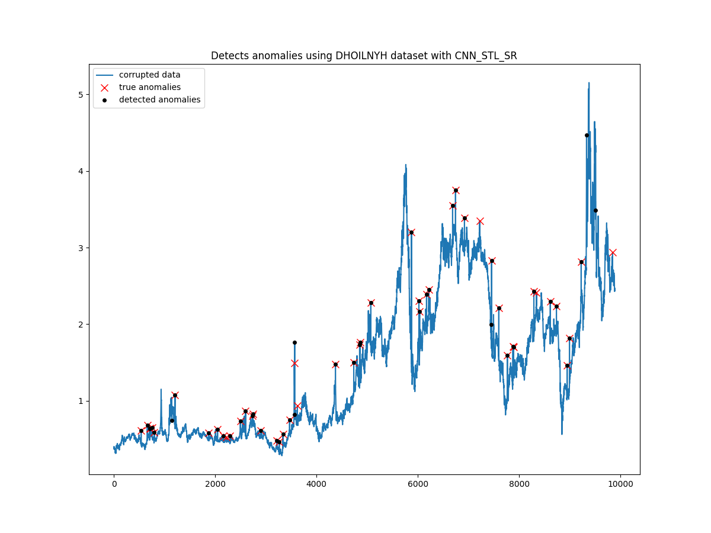

<h1 align="center">
    Phân tích dữ liệu giá dầu thô
</h1>

<div align="center">
  
  <a href="https://github.com/Phenikaa-University/Analysis-of-crude-oil-data"></a>
  <a href="https://github.com/Phenikaa-University/Analysis-of-crude-oil-data"></a>
  <a href="https://twitter.com/cngvng413"></a>
 
</div>

<p align="center">
    <br>
    
    <br>
<p>

The final exam is designed to expand on the concepts covered in the midterm exam and provide a deeper understanding of the subject matter. Specifically, we plan to introduce a Convolutional Neural Network (CNN) model, which will replace the traditional Neural Network (NN) model used in the midterm exam. The CNN model is a powerful tool that is commonly used in image processing and has shown promising results in a variety of applications. Additionally, we will incorporate the Spectral Residual (SR) method to enhance the data preprocessing phase of the model. This method has been demonstrated to effectively remove noise and artifacts from images, resulting in improved accuracy and performances.


## Author

<div align="center">

|  Họ và tên | MSSV | Lớp |
| -------- | -------- | -------- |
| [Vương Tuấn Cường](https://cngvng.github.io/)  | 21011490    | K15-KHMT    |

</div>

## Requirements

```
    conda create -n ai-dev python=3.8.16
```

```
    pip install -r requirements.txt
```

## Inference 

The checkpoints from folder `checkpoints`:
- For model CNN_STL saved in `checkpoints/cnn_stl.weights.h5`:

```
    bash scripts/test_cnn_stl.sh
```

- For model CNN_STL_SR saved in `checkpoints/cnn_stl_sr.weights.h5`

```
    bash scripts/test_cnn_stl_sr.sh
```

## Training

- For model CNN_STL:

```
    bash scripts/train_cnn_stl.sh
```

- For model CNN_STL_SR:

```
    bash scripts/train_cnn_stl_sr.sh
```