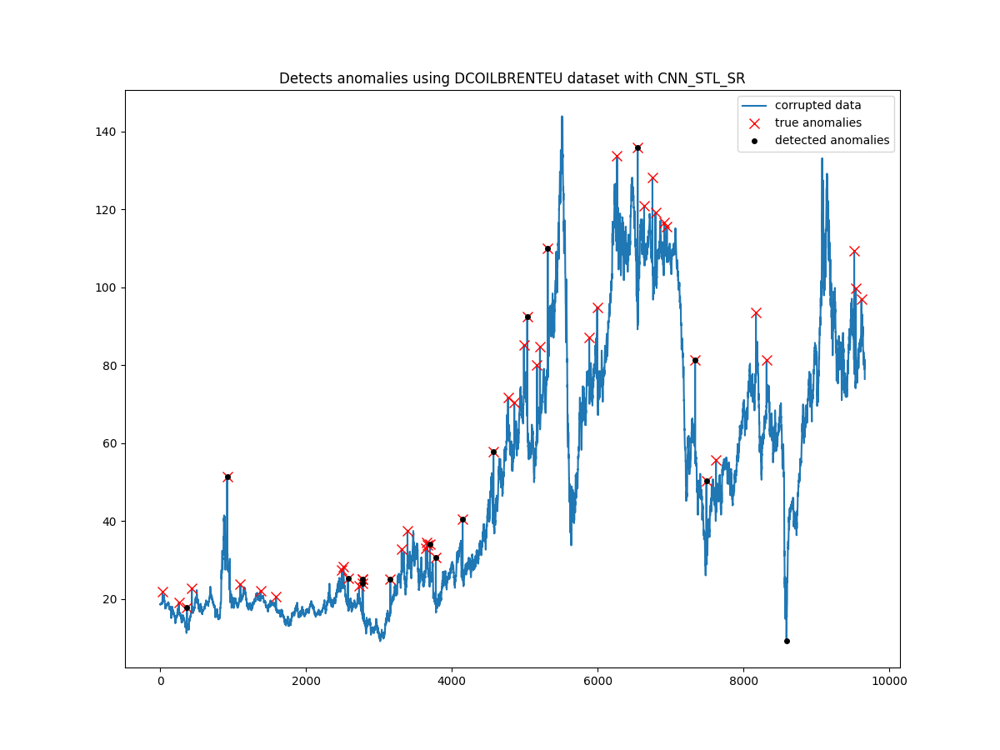

<h1 align="center">
    Phân tích dữ liệu giá dầu thô
</h1>

<div align="center">
  
  <a href="https://github.com/Phenikaa-University/Analysis-of-crude-oil-data"></a>
  <a href="https://github.com/Phenikaa-University/Analysis-of-crude-oil-data"></a>
  <a href="https://twitter.com/cngvng413"></a>
 
</div>

<p align="center">
    <br>
    
    <br>
<p>

Báo cáo thị trường dầu thô là một nguồn thông tin quan trọng về thị trường dầu thô. Báo cáo này cung cấp thông tin tổng quan về thị trường, giúp dự đoán xu hướng giá thị trường dầu thô trong tương lai, đánh giá các yếu tố rủi ro và hỗ trợ các nhà đầu tư trong việc đưa ra quyết định. Trong bài tập lớn này, chúng tôi tập trung vào việc phân tích dữ liệu giá dầu thô dựa trên cơ sở dữ liệu FRED để đưa ra các cách phân tích và đánh giá đồng thời dự đoán các yếu tố tác động gây nên sự bất thường trong biến đổi giá cả của thị trường dầu mỏ.


## Author

<div align="center">

|  Họ và tên | MSSV | Lớp |
| -------- | -------- | -------- |
| [Vương Tuấn Cường](https://cngvng.github.io/)  | 21011490    | K15-KHMT    |

</div>

## Requirements

```
    conda create -n ai-dev python=3.8.16
```

```
    pip install -r requirements.txt
```

## Demo

```
    streamlit run st.py
```

## Inference 

The checkpoints from folder `checkpoints`:
- For model CNN_STL saved in `checkpoints/cnn_stl.weights.h5`:

```
    bash scripts/test_cnn_stl.sh
```

- For model CNN_STL_SR saved in `checkpoints/cnn_stl_sr.weights.h5`

```
    bash scripts/test_cnn_stl_sr.sh
```

## Training

- For model CNN_STL:

```
    bash scripts/train_cnn_stl.sh
```

- For model CNN_STL_SR:

```
    bash scripts/train_cnn_stl_sr.sh
```